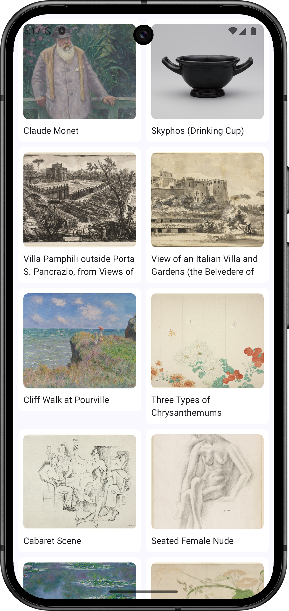

# Chicago Art Gallery paging grid App

**Author: Dean Ezra**



[Video here](./screenshots/app-video-showing-paging.mp4) of paging in motion ;-)

This Android application is a proof of concept that demonstrates the integration of the Paging 3 library with Jetpack Compose's LazyVerticalGrid component. 

The application utilises the MVVM (Model-View-ViewModel) architecture pattern with Clean Architecture principles.


For content it showcases artworks from the [Art Institute of Chicago using their public AP](https://api.artic.edu/docs/).

**Interesting note about images served by the API:**
The Chicago art api implements the 'IIIF Image API v2.0' spec allowing a developer to retrieve specific sizes of image instead of having to waste bandwidth downloading large images and then resizing them in app. More details can be seen [here](https://api.artic.edu/docs/#iiif-image-api).

## Features of the app

- Demonstrates the use of Paging 3 library with Compose UI's LazyVerticalGrid
- Displays a grid of artworks from the Art Institute of Chicago
- Implements infinite scrolling with pagination (12 items per page)
- Uses Jetpack Compose for building a modern, declarative UI
- Follows MVVM architecture for clean separation of concerns
- Utilizes Kotlin Coroutines and Flow for asynchronous operations
- Implements dependency injection using Hilt

## Technical Details

- **UI and Pagination**: The app showcases the powerful combination of Jetpack Compose's `LazyVerticalGrid` with the Paging 3 library. This integration allows for efficient loading and display of large datasets in a grid layout, with automatic pagination as the user scrolls.

- **Paging Implementation**: As the user scrolls to the bottom of the grid, more items are loaded automatically. This is handled by the Paging 3 library, which seamlessly integrates with Jetpack Compose to provide a smooth, infinite scrolling experience.

- **Networking**: The app fetches data from the Art Institute of Chicago's public API, demonstrating how Paging 3 can be used with real-world APIs. Each page request retrieves 12 items.

- **Image Loading**: Artwork images are loaded asynchronously using the Coil library, which is optimized for Jetpack Compose.

- **Architecture**: The app follows the MVVM pattern with Clean Architecture principles:
  - **Model**: 
    - `Artwork` data class represents the artwork entity.
    - `ArtworkRepository` interface defines the data operations.
    - `ArtworkRepositoryImpl` implements the repository interface, handling data fetching and caching.
  - **View**: Compose UI components that display the data, primarily in `ArtworksGridScreen`.
  - **ViewModel**: `ArtworksViewModel` prepares and manages the data for the UI.
  - **Use Case**: `GetArtworksPagedUseCase` encapsulates the business logic for fetching paginated artworks.

- **Data Flow**:
  1. The `ArtworksViewModel` invokes the `GetArtworksPagedUseCase`.
  2. The use case calls the `ArtworkRepository` to fetch data.
  3. The repository uses a `PagingSource` to load data from the API.
  4. The ViewModel exposes the data as a `Flow<PagingData<Artwork>>`.
  5. The UI collects this flow and displays it in the `LazyVerticalGrid`.

- **Dependency Injection**: Hilt is used to provide dependencies throughout the app, ensuring a clean and testable architecture.

## Getting Started

To run this project:

1. Clone the repository
2. Open the project in Android Studio

3. Set up the environment variable for the contact email:
   The Chicago Art Institute API requires a contact email to be included in the header of web API calls. This app uses an environment variable to avoid hardcoding the email in the source code.

   - On Windows:
     1. Open the System Properties (Right-click on 'This PC' > Properties > Advanced system settings)
     2. Click on 'Environment Variables'
     3. Under 'User variables', click 'New'
     4. Set the variable name as `CONTACT_EMAIL_FOR_USER_AGENT`
     5. Set the variable value as your contact email
     6. Click 'OK' to save

   - On macOS:
     1. Open your terminal
     2. Edit your shell profile file (e.g., `~/.zshrc` for Zsh or `~/.bash_profile` for Bash)
     3. Add the following line:
        ```
        export CONTACT_EMAIL_FOR_USER_AGENT="your.email@example.com"
        ```
     4. Save the file and run `source ~/.zshrc` (or `source ~/.bash_profile` for Bash)

4. Restart Android Studio to ensure it picks up the new environment variable

Note:
The environment variable is then read from the OS via the project's `build.gradle.kts` file, using the `buildConfigField`:

   ```kotlin
   buildConfigField("String", "CONTACT_EMAIL", "\"${System.getenv("CONTACT_EMAIL_FOR_USER_AGENT")}\"")

   ```
   
   
## Unit Tests
This project includes unit tests for the ViewModel and Use Case components, demonstrating the testability of the MVVM architecture:

### ViewModel Tests: 

ArtworksViewModelTest verifies the behavior of the ArtworksViewModel, ensuring it correctly interacts with the use case and transforms the data for the UI.

### Use Case Tests: 

GetArtworksPagedUseCaseTest checks that the GetArtworksPagedUseCase properly invokes the repository and returns the expected Flow of PagingData<Artwork>.

### Learnings for future re Testing Paging 3

I found testing components that use the Paging 3 library can be challenging due to the opaque nature of PagingData. It was hard to know what I should and could test in relation to the Paging components.

Therefore my tests focus on verifying:
1. The correct creation and configuration of Pager objects
2. Proper invocation of dependencies (repository, API service)
3. Correct emission of Flow<PagingData<Artwork>>

For more detailed testing of paging behavior, I would consider in the future using the PagingSource testing utilities provided by the Paging library, or implementing custom test doubles that allow for more granular assertions.

## Dependencies
* Jetpack Compose
* Paging 3
* Hilt for dependency injection
* Retrofit for networking
* Coil for image loading
* Kotlin Coroutines and Flow


### API Reference
This app uses the Art Institute of Chicago's public API. You can find more information about the API here:
[Art Institute of Chicago API](https://api.artic.edu/docs/)


### License
MIT License
